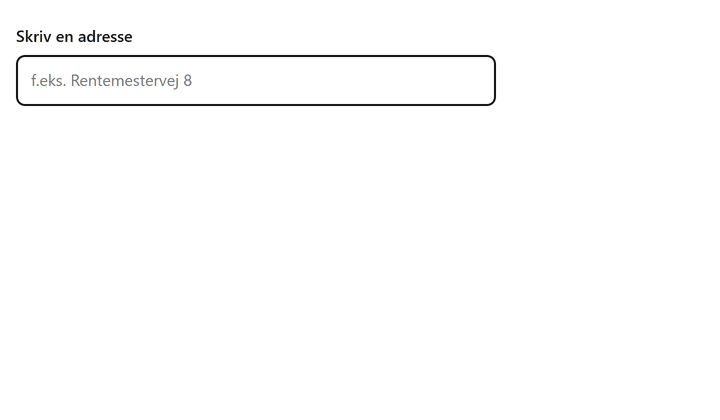

# @companydata-dk/dawa-autocomplete

[](https://www.npmjs.com/package/@companydata-dk/dawa-autocomplete)
[](LICENSE)
[](https://companydata-dk.github.io/dawa-autocomplete/)

**DAWA lukker 1. oktober 2026. Din adresse-autocomplete behøver ikke at lukke med.**

Dette er [dawa-autocomplete2](https://github.com/SDFIdk/dawa-autocomplete2) (MIT, Styrelsen for Dataforsyning og Infrastruktur), samme komponent, samme forslag, samme data, blot med [dawa.companydata.dk](https://dawa.companydata.dk) som kilde. Skift pakken ud, eller sæt én indstilling, så virker din adressesøgning igen.



**[Prøv den live](https://companydata-dk.github.io/dawa-autocomplete/)**, den taler med den rigtige tjeneste.

## Tre måder at komme i gang

**1. Har du dawa-autocomplete2 i forvejen?** Behold koden og sæt base-URL'en:

```js
dawaAutocomplete(inputElm, { baseUrl: 'https://dawa.companydata.dk', select: valgt => ... });
```

**2. Script-tag**, ingen build:

```html
<link rel="stylesheet" href="https://cdn.companydata.dk/dawa-autocomplete/2.0.0/dawa-autocomplete2.css">
<input id="adresse" type="text" autocomplete="off">
<script src="https://cdn.companydata.dk/dawa-autocomplete/2.0.0/dawa-autocomplete2.min.js"></script>
<script>
  dawaAutocomplete.dawaAutocomplete(document.getElementById('adresse'), {
    select: valgt => console.log(valgt.data.id, valgt.tekst)
  });
</script>
```

**3. npm:**

```
npm install @companydata-dk/dawa-autocomplete
```

```js
import { dawaAutocomplete } from '@companydata-dk/dawa-autocomplete';

dawaAutocomplete(document.getElementById('adresse'), {
  select: valgt => console.log(valgt.data.id, valgt.tekst),
});
```

## Hvad er nyt

To ting, resten er uændret:

- `baseUrl` er `https://dawa.companydata.dk` som standard.
- `apiKey` (valgfri) lægger din companydata-nøgle i stien, så loftet hæves fra det nøgleløse niveau. Widgets i browseren kan ikke sende headers, derfor stien.

```js
dawaAutocomplete(inputElm, { apiKey: 'sk_din_noegle', select: valgt => ... });
```

Uden nøgle er brugen begrænset pr. IP-adresse, rigeligt til at prøve og til små sites. En gratis nøgle fås på [companydata.dk/api](https://companydata.dk/api); adressekald tæller ikke på nøglens API-kvote.

## Indstillinger

Alle indstillinger fra dawa-autocomplete2 gælder uændret: `baseUrl`, `minLength`, `params`, `fuzzy`, `stormodtagerpostnumre`, `supplerendebynavn`, `type`, `adgangsadresserOnly`, `debounce`, `select`, `multiline`, `id`. Hertil `apiKey`. `fuzzy` virker som i DAWA: et vejnavn med en tastefejl scores mod alle vejnavne, husnummeret skal stadig passe.

`select` får samme objekt som før: `type`, `tekst`, `forslagstekst`, `caretpos` og `data` med DAR-id, vejnavn, husnr, etage, dør, postnr, kommunekode og koordinater. Id'erne er de samme UUID'er, som DAWA gav, så gemte adresser matcher stadig.

## Tjenesten bag

[dawa.companydata.dk](https://dawa.companydata.dk) svarer på DAWA's stier med DAWA's JSON: autocomplete, adresser, adgangsadresser, reverse geokodning, adressevask, postnumre og kommuner. Data kommer fra Danmarks Adresseregister via Datafordeleren og opdateres hver nat. Forskelle fra DAWA står på forsiden af tjenesten.

## English

DAWA, the Danish address API, closes on 1 October 2026. This package is the official dawa-autocomplete2 widget with its default base URL pointed at dawa.companydata.dk, a drop-in replacement that serves DAWA's paths, parameters, JSON and UUIDs. Existing dawa-autocomplete2 installs migrate by setting `baseUrl: 'https://dawa.companydata.dk'`; new ones install this package. An optional `apiKey` option raises the per-IP ceiling. Everything else is unchanged.

## Kildekode og fejl

Koden ligger her, [github.com/companydata-dk/dawa-autocomplete](https://github.com/companydata-dk/dawa-autocomplete). Fejl og ønsker som issues samme sted.

## Byg

```
npm install
npm run build
```

Bygget lander i `dist/js` (UMD og ES, med og uden polyfills) og `dist/css`.

## Licens

MIT. Ophavsret 2017 Danmarks adresser for den oprindelige komponent, se `LICENSE`. Ændringerne er ophavsret 2026 Uneven Bits ApS under samme licens.
